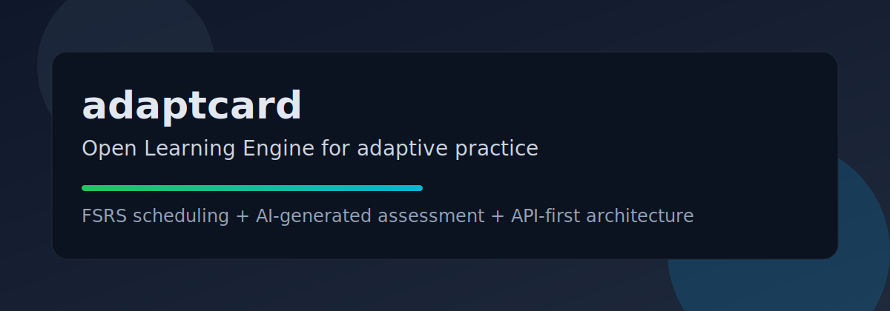

# adaptcard



Open Learning Engine for adaptive practice, powered by FSRS scheduling and AI-generated assessment.

> Build adaptive learning workflows for any domain: history, algorithms, sports, language, certifications, and more.

## Why adaptcard

Most learning tools are either static flashcards or heavy LMS platforms.
adaptcard is the middle layer: a composable engine that gives you adaptive scheduling + dynamic assessment generation.

- Domain-agnostic knowledge point model
- FSRS-powered review scheduling
- AI-generated fresh quiz content per review session
- API-first backend for integration into your own product
- Local-model support (Ollama) for privacy-sensitive setups

## Core capabilities

- Store reusable knowledge points (`front`, `back`, `context`, `tags`)
- Generate quiz sets on demand (`mock`, `openai`, `ollama`)
- Map answer accuracy into FSRS rating updates
- Keep generated cards for 3 days by default (with optional pinning)
- Return next due review based on spaced repetition state

## Stack

- TypeScript + Fastify
- SQLite (`better-sqlite3`)
- FSRS (`ts-fsrs`)

## Quick start

```bash
git clone https://github.com/fkx816/adaptcard.git
cd adaptcard
npm install --include=dev
cp .env.example .env
npm run dev
```

Health check:

```bash
curl http://127.0.0.1:8787/health
```

## Environment variables

- `PORT` - HTTP port
- `DATABASE_PATH` - SQLite path
- `AI_PROVIDER` - `mock` | `openai` | `ollama`
- `OPENAI_BASE_URL` / `OPENAI_API_KEY` / `OPENAI_MODEL`
- `OLLAMA_BASE_URL` / `OLLAMA_MODEL`

See `.env.example`.

## API (MVP)

### 1) Create knowledge point

```bash
curl -X POST http://127.0.0.1:8787/knowledge-points \
  -H 'content-type: application/json' \
  -d '{"front":"binary search","back":"O(log n) divide-and-conquer lookup","tags":["algorithms","cs"]}'
```

### 2) Get next due review item

```bash
curl http://127.0.0.1:8787/reviews/next
```

### 3) Generate quiz for a knowledge point

```bash
curl -X POST http://127.0.0.1:8787/quiz/generate \
  -H 'content-type: application/json' \
  -d '{"knowledgePointId":"<id>","count":3,"pin":false}'
```

### 4) Submit quiz answers

```bash
curl -X POST http://127.0.0.1:8787/quiz/submit \
  -H 'content-type: application/json' \
  -d '{
    "cardId":"<card-id>",
    "answers":[
      {"questionId":"q1","userAnswer":"O(log n) divide-and-conquer lookup"}
    ]
  }'
```

Response includes `correctRate`, mapped `rating`, and `nextDueAt`.

## API error contract

All non-2xx responses return a consistent envelope:

```json
{
  "error": {
    "code": "VALIDATION_ERROR",
    "message": "Request validation failed",
    "details": []
  }
}
```

Common error codes:
- `VALIDATION_ERROR`
- `KNOWLEDGE_POINT_NOT_FOUND`
- `CARD_NOT_FOUND`
- `INTERNAL_ERROR`

## Quality checks

```bash
npm run lint
npm run test
npm run build
```

## Scenario demo requests

These examples show how the same engine works across very different domains.

### A) History

```bash
curl -X POST http://127.0.0.1:8787/knowledge-points \
  -H 'content-type: application/json' \
  -d '{
    "front":"What triggered World War I?",
    "back":"The assassination of Archduke Franz Ferdinand in 1914.",
    "context":"Early 20th century Europe, alliance tensions",
    "tags":["history","ww1"]
  }'
```

### B) Algorithms

```bash
curl -X POST http://127.0.0.1:8787/knowledge-points \
  -H 'content-type: application/json' \
  -d '{
    "front":"When should you use BFS instead of DFS?",
    "back":"Use BFS when shortest path in an unweighted graph matters.",
    "context":"Graph traversal strategy selection",
    "tags":["algorithms","graphs"]
  }'
```

### C) Sports

```bash
curl -X POST http://127.0.0.1:8787/knowledge-points \
  -H 'content-type: application/json' \
  -d '{
    "front":"What is progressive overload?",
    "back":"Gradually increasing training stress over time to drive adaptation.",
    "context":"Strength training fundamentals",
    "tags":["sports","fitness","training"]
  }'
```

Then run:

```bash
curl -X POST http://127.0.0.1:8787/quiz/generate \
  -H 'content-type: application/json' \
  -d '{"knowledgePointId":"<id-from-create>","count":4,"pin":false}'
```

## Project layout

- `src/server.ts` - app entry
- `src/db/` - sqlite + migration
- `src/models/` - persistence access
- `src/services/` - FSRS, quiz generation, review scoring
- `src/routes/` - API routes

## Roadmap highlights

- More question strategies (cloze, reverse recall, scenario simulation)
- Explainable mastery model beyond raw accuracy
- User/accounts + multi-tenant data isolation
- Frontend learner workspace
- SDK and integration guides for external products
- Anki-level browser and card management parity
- One-click deployment profiles

## Planning and maintenance

- Full roadmap: `docs/DEVELOPMENT_PLAN.md`
- Maintenance runbook: `docs/MAINTENANCE_RUNBOOK.md`
- Product positioning: `docs/PRODUCT_POSITIONING.md`
- Anki parity plan: `docs/ANKI_PARITY_PLAN.md`
- Frontend product spec: `docs/FRONTEND_PRODUCT_SPEC.md`
- Deployment blueprint: `docs/DEPLOYMENT_BLUEPRINT.md`

## Open-source docs

- `LICENSE`
- `CONTRIBUTING.md`
- `SECURITY.md`
- `CODE_OF_CONDUCT.md`
