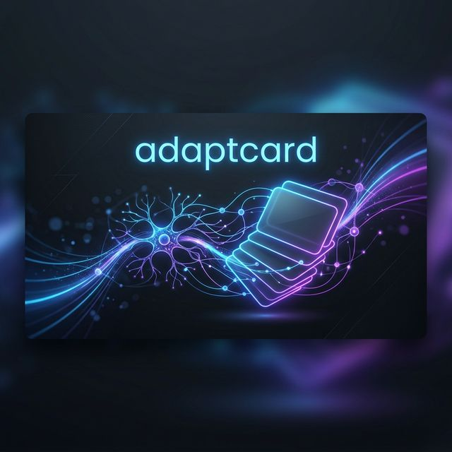
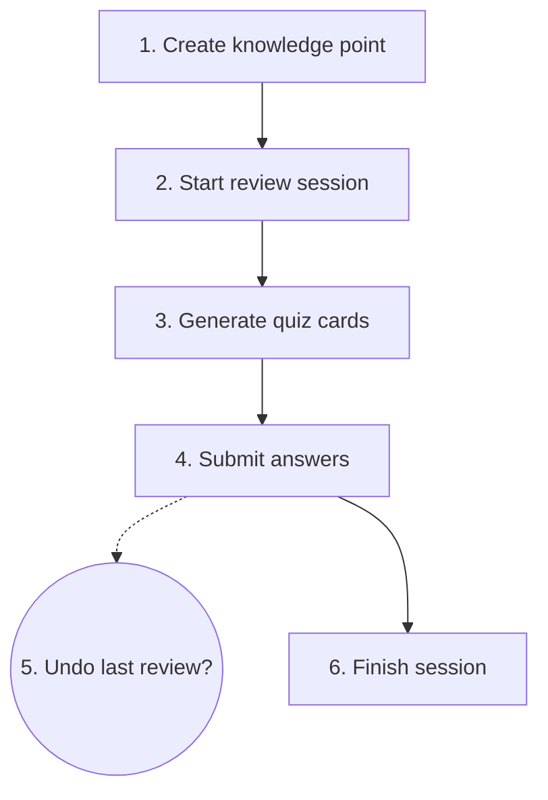

<div align="center">



# adaptcard

**An open-source adaptive learning engine — spaced repetition scheduling meets AI-generated assessment.**

[](LICENSE)
[](https://www.typescriptlang.org/)
[](https://www.fastify.io/)
[](https://www.sqlite.org/)
[](docs/openapi.yaml)

[Features](#-key-features) • [Quick Start](#-quick-start) • [API Examples](#-api-usage-examples) • [Documentation](docs/) • [Contributing](CONTRIBUTING.md)

</div>

---

## 🌟 What is adaptcard?

**adaptcard** is a **composable, API-first learning engine** that combines two proven techniques:

1. 🧠 **Spaced repetition scheduling** — an evidence-based algorithm that determines the optimal moment to review each item, minimizing review load while maximizing long-term retention.
2. ✨ **AI-generated quiz content** — fresh questions are generated at review time, so you're tested on genuine understanding rather than pattern-matching.

It is **domain-agnostic** by design. Use the same engine to build study workflows for software engineering, history, language learning, professional certifications, fitness coaching, or any knowledge-intensive domain.

> 💡 **adaptcard is the infrastructure layer. You bring the knowledge; adaptcard handles when and how to test it.**

---

## 🎯 Why adaptcard?

| Category | Traditional tools | adaptcard |
|---|---|---|
| **Static flashcard apps** | Fixed, pre-authored questions | ✅ AI-generated questions per session |
| **Heavy LMS platforms** | Monolithic, opinionated, hard to extend | ✅ Composable REST API — integrate into anything |
| **Raw scheduling libraries** | No content layer, no quiz lifecycle | ✅ Full session lifecycle with scheduling |
| **Proprietary AI tutors** | Closed, subscription-gated | ✅ Open-source, self-hostable, local-model support |

---

## 🚀 Key Features

- 📦 **Domain-agnostic knowledge model** — store any topic with `front`, `back`, `context`, and `tags`
- 🧠 **Spaced repetition scheduling** — evidence-based algorithm that optimizes review intervals per item
- ✨ **AI quiz generation** — fresh questions per session via OpenAI, Ollama, or a deterministic mock
- 🔁 **Full review session lifecycle** — start → progress → undo → finish with atomic state tracking
- 🎯 **Filtered custom study sessions** — start scoped sessions by deck, tags, state, and due-date window, with due/overdue workload summary on session detail
- 🗂 **Deck hierarchy** — nested decks with guardrails (no orphan deletes, clean tree management)
- 🃏 **Card browser + rendered sides** — query/filter cards and receive `rendered.prompt` + `rendered.answer` for `basic`, `reverse`, and `cloze:N` cards (no frontend template reconstruction required)
- 📝 **Note + card templates** — `basic`, `reverse`, and `cloze` card types, with optional `knowledgePointId` linkage for note-level learning timelines
- 🔒 **Local-model support** — full Ollama integration for privacy-sensitive or air-gapped setups
- 📄 **OpenAPI spec** — machine-readable contract at [`docs/openapi.yaml`](docs/openapi.yaml)

---

## ⚡ Quick Start

Get up and running locally in seconds:

```bash
# 1. Clone the repository
git clone https://github.com/fkx816/adaptcard.git
cd adaptcard

# 2. Install dependencies
npm install --include=dev

# 3. Configure environment
cp .env.example .env

# 4. Start the development server
npm run dev
```

Verify the server is running:
```bash
curl http://127.0.0.1:8787/health
```

---

## ⚙️ Configuration

Manage your environment through variables:

| Variable | Description | Default |
|---|---|---|
| `PORT` | HTTP port | `8787` |
| `DATABASE_PATH` | SQLite database file path | — |
| `AI_PROVIDER` | `mock` \| `openai` \| `ollama` | `mock` |
| `OPENAI_BASE_URL` | Custom OpenAI-compatible base URL | — |
| `OPENAI_API_KEY` | OpenAI API key | — |
| `OPENAI_MODEL` | Model identifier | — |
| `OLLAMA_BASE_URL` | Ollama server URL | — |
| `OLLAMA_MODEL` | Ollama model name | — |

> 📚 *See `.env.example` for a full reference.*

---

## 🗺️ API Overview

<details>
<summary><strong>View all endpoints</strong></summary>

| Area | Method | Path | Status |
|---|---|---|:---:|
| Health | `GET` | `/health` | ✅ |
| Knowledge points | `POST` / `GET` | `/knowledge-points` | ✅ |
| Knowledge point review history timeline | `GET` | `/knowledge-points/:id/review-history` | ✅ |
| Next due item | `GET` | `/reviews/next` | ✅ |
| Quiz generate | `POST` | `/quiz/generate` | ✅ |
| Quiz submit | `POST` | `/quiz/submit` | ✅ |
| Review sessions + workload summary | `POST` / `GET` | `/review-sessions/start`, `/review-sessions/:id` | ✅ |
| Session scoped queue | `GET` | `/review-sessions/:id/queue` | ✅ |
| Session finish | `POST` | `/review-sessions/:id/finish` | ✅ |
| Undo last review | `POST` | `/review-sessions/:id/undo-last-review` | ✅ |
| Decks (CRUD) | `POST`/`GET`/`PATCH`/`DELETE` | `/decks`, `/decks/:id` | ✅ |
| Notes | `POST` / `GET` | `/notes` | ✅ |
| Note review history timeline | `GET` | `/notes/:id/review-history` | ✅ |
| Card browser | `GET` | `/cards` | ✅ |
| Card review history timeline | `GET` | `/cards/:id/review-history` | ✅ |
| Suspend / unsuspend| `POST` | `/cards/:id/suspend`, `/cards/:id/unsuspend` | ✅ |
| Bulk move / retag | `POST` | `/cards/bulk/move-deck`, `/cards/bulk/retag` | ✅ |
| Saved filters | `POST` / `GET` | `/cards/filters`, `/cards/filters/:id/apply` | ✅ |

</details>

### Recommended Review Flow


```mermaid
graph TD;
    A[1. Create knowledge point] --> B[2. Start review session];
    B --> C[3. Generate quiz cards];
    C --> D[4. Submit answers];
    D -.-> E((5. Undo last review?));
    D --> F[6. Finish session];
```

---

## 💻 API Usage Examples

### 1️⃣ Create a knowledge point

```bash
curl -X POST http://127.0.0.1:8787/knowledge-points \
  -H 'content-type: application/json' \
  -d '{
    "front": "What is binary search?",
    "back": "O(log n) divide-and-conquer lookup in a sorted array.",
    "context": "Classic algorithm design",
    "tags": ["algorithms", "cs"]
  }'
```

### 2️⃣ Inspect review history timeline for a knowledge point

```bash
curl 'http://127.0.0.1:8787/knowledge-points/<knowledge-point-id>/review-history?limit=10&offset=0'

# Response includes rating/correctRate trend + per-attempt answer stats:
# {
#   "knowledgePointId": "<id>",
#   "items": [{ "reviewedAt": "...", "rating": 4, "correctRate": 1, "stats": { "total": 3, "correct": 3 } }],
#   "page": { "limit": 10, "offset": 0, "total": 24 }
# }
```

### 3️⃣ Inspect review history timeline for a generated card

```bash
curl 'http://127.0.0.1:8787/cards/<card-id>/review-history?limit=10&offset=0'

# Response includes timeline entries for that generated quiz card:
# {
#   "cardId": "<card-id>",
#   "items": [{ "reviewedAt": "...", "rating": 4, "stats": { "total": 2, "correct": 2 } }],
#   "page": { "limit": 10, "offset": 0, "total": 1 }
# }
```

### 4️⃣ Create a note linked to a knowledge point

```bash
curl -X POST http://127.0.0.1:8787/notes \
  -H 'content-type: application/json' \
  -d '{
    "deckId": "<deck-id>",
    "knowledgePointId": "<knowledge-point-id>",
    "front": "What is memoization?",
    "back": "Caching repeated subproblem results",
    "tags": ["algorithms", "dp"],
    "cardType": "basic"
  }'
```

### 5️⃣ Inspect review history timeline for a note

```bash
curl 'http://127.0.0.1:8787/notes/<note-id>/review-history?limit=10&offset=0'

# Response uses linked knowledge point logs when knowledgePointId is present:
# {
#   "noteId": "<note-id>",
#   "knowledgePointId": "<knowledge-point-id>",
#   "items": [{ "reviewedAt": "...", "correctRate": 1, "stats": { "total": 2, "correct": 2 } }],
#   "page": { "limit": 10, "offset": 0, "total": 4 }
# }
```

### 6️⃣ Start a review session

```bash
curl -X POST http://127.0.0.1:8787/review-sessions/start \
  -H 'content-type: application/json' \
  -d '{}'
```

### 7️⃣ Start a filtered custom study session

```bash
curl -X POST http://127.0.0.1:8787/review-sessions/start \
  -H 'content-type: application/json' \
  -d '{
    "scope": {
      "deckId": "<deck-id>",
      "tags": ["graphs"],
      "state": "new",
      "dueBefore": "2026-12-31T23:59:59.000Z"
    }
  }'

curl 'http://127.0.0.1:8787/review-sessions/<session-id>/queue?limit=20&offset=0'

# Session detail now includes queueSummary:
# {
#   "session": {
#     "queueSummary": { "totalCount": 42, "dueCount": 18, "overdueCount": 6 }
#   }
# }
curl 'http://127.0.0.1:8787/review-sessions/<session-id>'
```

### 8️⃣ Generate a quiz

```bash
curl -X POST http://127.0.0.1:8787/quiz/generate \
  -H 'content-type: application/json' \
  -d '{"knowledgePointId": "<id>", "count": 3, "pin": false}'
```

---

## 🃏 Deck and Card Management

<details>
<summary><strong>Show Deck & Card Commands</strong></summary>

### Create nested decks

```bash
# Create a top-level deck
curl -X POST http://127.0.0.1:8787/decks \
  -H 'content-type: application/json' \
  -d '{"name": "Algorithms"}'

# Create a child deck
curl -X POST http://127.0.0.1:8787/decks \
  -H 'content-type: application/json' \
  -d '{"name": "Graph Theory", "parentId": "<algorithms-deck-id>"}'
```

### Create notes with card templates

| `cardType` | Cards generated | Description |
|---|:---:|---|
| `basic` | 1 | Standard front → back recall |
| `reverse` | 2 | Adds mirrored back → front card |
| `cloze` | N | One card per `{{cN::...}}` marker |

```bash
# Basic card
curl -X POST http://127.0.0.1:8787/notes \
  -H 'content-type: application/json' \
  -d '{
    "deckId": "<deck-id>",
    "front": "When should you use BFS?",
    "back": "When finding the shortest path in an unweighted graph.",
    "tags": ["algorithms", "graphs"],
    "cardType": "basic"
  }'
```

### Browse and manage cards

```bash
# Search and filter
curl 'http://127.0.0.1:8787/cards?search=shortest&state=new&sortBy=dueAt&sortOrder=asc&limit=20'

# Suspend / unsuspend
curl -X POST http://127.0.0.1:8787/cards/<card-id>/suspend
curl -X POST http://127.0.0.1:8787/cards/<card-id>/unsuspend
```

### Inspect recursive deck workload at a glance

```bash
curl 'http://127.0.0.1:8787/decks/<deck-id>'

# Response includes subtree workload rollup for planning:
# {
#   "deck": {
#     "id": "<deck-id>",
#     "name": "Algorithms",
#     "childrenCount": 3,
#     "workload": {
#       "totalCount": 36,
#       "dueCount": 12,
#       "overdueCount": 4,
#       "stateBreakdown": {
#         "new": 8,
#         "review": 20,
#         "suspended": 8
#       }
#     }
#   }
# }
```

Every card response now includes a `rendered` payload so web/mobile clients can display review sides directly:

```json
{
  "cardType": "cloze:2",
  "front": "TCP uses {{c1::three-way handshake}}",
  "back": "Flow: {{c1::SYN}}, {{c2::SYN-ACK}}, {{c3::ACK}}",
  "rendered": {
    "prompt": "TCP uses three-way handshake\n\nFlow: SYN, [...], ACK",
    "answer": "TCP uses three-way handshake\n\nFlow: SYN, SYN-ACK, ACK"
  }
}
```
</details>

---

## 🌍 Domain Examples

adaptcard is **content-neutral**. The same API works across radically different domains:

<details>
<summary><strong>📖 History</strong></summary>

```bash
curl -X POST http://127.0.0.1:8787/knowledge-points \
  -H 'content-type: application/json' \
  -d '{
    "front": "What triggered World War I?",
    "back": "The assassination of Archduke Franz Ferdinand in Sarajevo, 1914.",
    "context": "Early 20th-century Europe, escalating alliance tensions",
    "tags": ["history", "ww1"]
  }'
```
</details>

<details>
<summary><strong>💻 Algorithms</strong></summary>

```bash
curl -X POST http://127.0.0.1:8787/knowledge-points \
  -H 'content-type: application/json' \
  -d '{
    "front": "When should you use BFS instead of DFS?",
    "back": "Use BFS when shortest path in an unweighted graph matters.",
    "context": "Graph traversal strategy selection",
    "tags": ["algorithms", "graphs"]
  }'
```
</details>

<details>
<summary><strong>🏋️ Sports & Fitness</strong></summary>

```bash
curl -X POST http://127.0.0.1:8787/knowledge-points \
  -H 'content-type: application/json' \
  -d '{
    "front": "What is progressive overload?",
    "back": "Gradually increasing training stress over time to drive physiological adaptation.",
    "context": "Strength training fundamentals",
    "tags": ["sports", "fitness", "training"]
  }'
```
</details>

---

## 🛠 Tech Stack

| Layer | Technology |
|---|---|
| **Runtime** | Node.js (ESM) |
| **Language** | TypeScript 5.x |
| **HTTP Framework** | Fastify 5.x |
| **Database** | SQLite via `better-sqlite3` (WAL mode) |
| **Scheduling Algorithm** | FSRS via `ts-fsrs` |
| **Schema Validation** | Zod |
| **AI Providers** | OpenAI API, Ollama, or deterministic mock |

---

## 📈 Roadmap

- **Phase 1** — MVP & Core API (✅ Completed)
- **Phase 2** — Study Session Quality *(active)*
- **Phase 3** — Auth and Multi-User
- **Phase 4** — Frontend Learner Workspace
- **Phase 5** — Developer Platform
- **Phase 6** — Operational Maturity

> *See [DEVELOPMENT_PLAN.md](docs/DEVELOPMENT_PLAN.md) for full details.*

---

## 🤝 Contributing & Community

Contributions, issues, and feature requests are welcome!

| Resource | Link |
|---|---|
| ⚖️ **License** | [MIT](LICENSE) |
| 📖 **Contributing guide**| [CONTRIBUTING.md](CONTRIBUTING.md) |
| 🛡️ **Security policy** | [SECURITY.md](SECURITY.md) |
| 🫂 **Code of conduct** | [CODE_OF_CONDUCT.md](CODE_OF_CONDUCT.md) |

<div align="center">
  <sub>Built with ❤️ by the adaptcard community.</sub>
</div>
